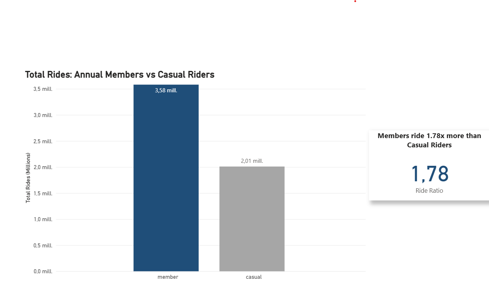
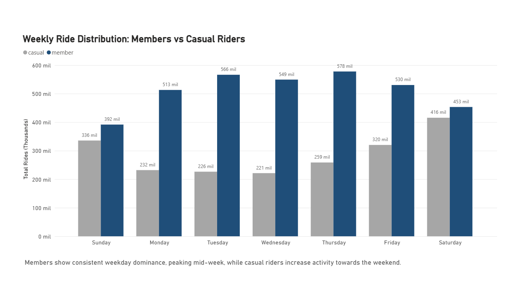
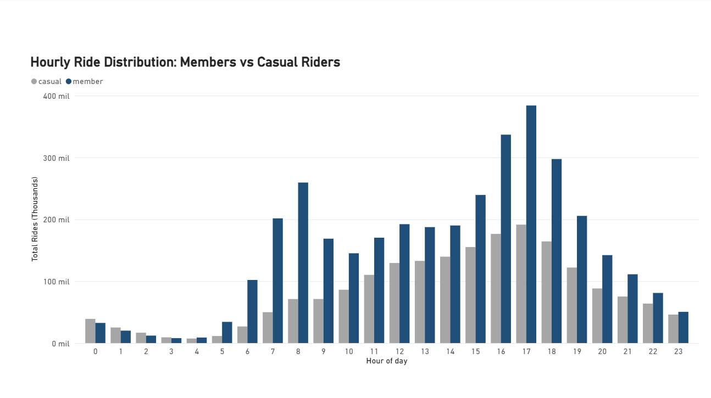
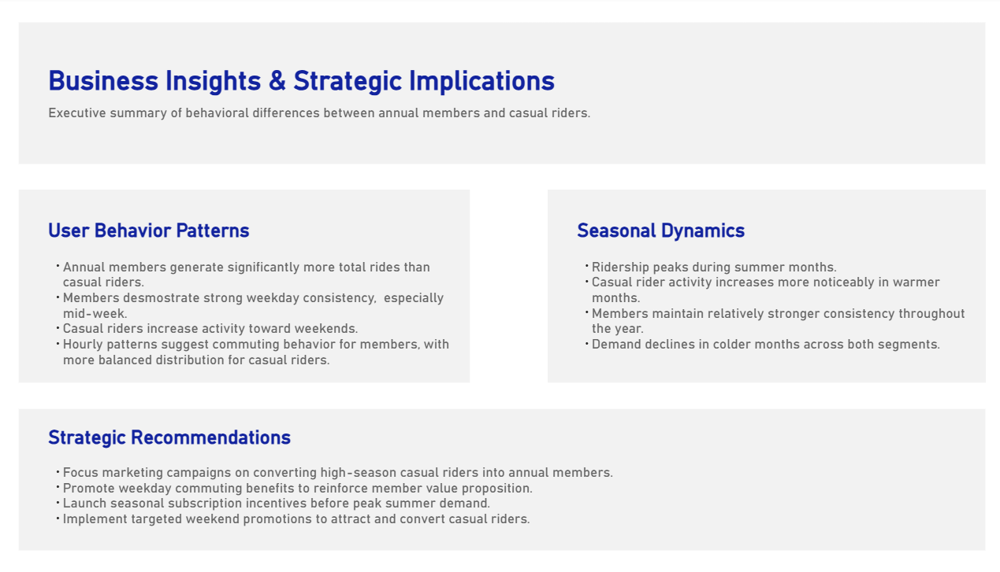

# Cyclistic: Análisis Miembros vs Usuarios Casuales

## Contexto del Negocio

Cyclistic es una empresa de bicicletas compartidas cuyo objetivo estratégico es convertir usuarios ocasionales (casual riders) en miembros anuales.  
Comprender las diferencias de comportamiento entre ambos segmentos es clave para diseñar estrategias de marketing basadas en datos y aumentar la conversión.

---

## Objetivo

Identificar patrones de comportamiento entre miembros anuales y usuarios casuales para respaldar decisiones estratégicas basadas en datos.

---

## Fuente de Datos

- Dataset público de Cyclistic
- Datos procesados con SQL en Google BigQuery
- Visualización y modelado en Power BI

---

## Proceso

1. Limpieza y transformación de datos en BigQuery.
2. Agregaciones por:
   - Tipo de usuario (miembro vs casual)
   - Día de la semana
   - Hora del día
   - Mes
3. Creación de tablas analíticas estructuradas.
4. Diseño del dashboard en Power BI siguiendo principios de jerarquía visual y claridad ejecutiva.

---

## Ejemplo de Consulta SQL

Consulta simplificada utilizada para analizar la distribución semanal de viajes:

```sql
SELECT
    user_type,
    EXTRACT(DAYOFWEEK FROM ride_date) AS weekday,
    COUNT(*) AS total_rides
FROM cyclistic_dataset.rides
GROUP BY user_type, weekday
ORDER BY user_type, weekday;

```

Esta consulta permitió analizar la distribución semanal de viajes entre miembros y usuarios casuales, facilitando la comparación de patrones de uso entre ambos segmentos.

---

# Principales Insights

## Patrones de Comportamiento

- Los miembros anuales generan significativamente más viajes totales que los usuarios casuales.
- Los miembros muestran una fuerte consistencia durante los días laborales, especialmente a mitad de semana.
- Los usuarios casuales incrementan su actividad hacia el fin de semana.
- La distribución horaria sugiere comportamiento de desplazamiento laboral en miembros (picos en horas punta de mañana y tarde), mientras que los usuarios casuales presentan una distribución más equilibrada.

---

## Dinámica Estacional

- La demanda alcanza su punto máximo durante los meses de verano.
- El crecimiento estacional es más pronunciado en usuarios casuales.
- Los miembros mantienen mayor estabilidad a lo largo del año.
- La actividad disminuye en meses fríos para ambos segmentos.

---

# Recomendaciones Estratégicas

- Enfocar campañas de conversión durante temporada alta, cuando la actividad casual es mayor.
- Reforzar la propuesta de valor del plan anual destacando ahorro y conveniencia para desplazamientos laborales.
- Lanzar incentivos de suscripción antes del inicio del verano.
- Implementar promociones específicas de fin de semana para captar usuarios ocasionales con alta probabilidad de conversión.

---

# Vista Previa del Dashboard

## 1️⃣ Total de Viajes y Ratio



Comparación del volumen total de viajes entre miembros y usuarios casuales, junto con el ratio relativo de uso.

---

## 2️⃣ Distribución Semanal



Análisis del comportamiento por día de la semana que evidencia mayor uso laboral en miembros y mayor concentración en fin de semana para usuarios casuales.

---

## 3️⃣ Distribución Horaria



Patrones por hora del día que reflejan desplazamientos laborales en miembros y uso más recreativo en usuarios casuales.

---

## 4️⃣ Estacionalidad Mensual


Evolución mensual de la demanda, destacando picos estivales y diferencias en intensidad estacional entre segmentos.

---

## 5️⃣ Insights Ejecutivos



Resumen estratégico consolidado con implicaciones de negocio derivadas del análisis.

---

# Herramientas Utilizadas

- SQL (Google BigQuery)
- Power BI
- GitHub

---

## Conclusión

Este proyecto demuestra cómo la segmentación conductual puede transformarse en decisiones estratégicas accionables mediante el uso de análisis de datos estructurado y visualización ejecutiva.

Integra extracción, transformación, modelado analítico y diseño de dashboard, mostrando un flujo completo de trabajo analítico de principio a fin.
